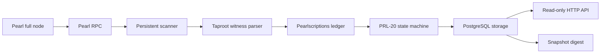

<p align="center">
  
</p>

<p align="center">
  <a href="https://www.pearlscriptions.com"></a>
  &nbsp;
  <a href="https://x.com/pearlscriptions"></a>
  &nbsp;
  <a href="docs/operators.md"></a>
  &nbsp;
  <a href="docs/api-contract.md"></a>
  &nbsp;
  <a href="docs/consensus.md"></a>
  &nbsp;
  <a href="CHANGELOG.md"></a>
</p>

<p align="center">
  <code>v1.1.2</code>
  ·
  <code>node >=22</code>
  ·
  <code>MIT</code>
  ·
  <code>read-only API</code>
  ·
  <code>PRL-20</code>
  ·
  <code>deterministic digest</code>
</p>

<p align="center">
  <strong>Independent read-only indexer for Pearlscriptions and PRL-20 on Pearl.</strong>
</p>

<p align="center">
  Run your own Pearl-backed indexer, reproduce canonical inscription numbers,
  derive PRL-20 state, and compare deterministic digests with other v1.1.2
  operators.
</p>

Pearlscriptions are Taproot witness inscriptions on Pearl. PRL-20 is the first
fungible token protocol built on top of that inscription layer.

This package is intentionally narrow. It indexes and serves public chain state.
It does not create wallets, hold keys, sign transactions, broadcast transactions,
run the official Pearlscriptions marketplace, expose an orderbook, or provide
trading APIs.

The official Pearlscriptions marketplace is an application layer built on top of
transfer lots. It is not part of this public indexer release.

The `v1.1.2` release keeps the public indexer read-only and adds optional
operator metadata for the Pearlscriptions operator registry. Registration,
monitoring, scoring, and rewards remain official application-layer services
outside this repository.

This patch release hardens operator registry checks by serving digest metadata
from the published snapshot, using live no-store headers for registry-critical
state, making Postgres snapshot updates safer under sync, and supporting a
separate public API process plus private sync worker for steadier registry
health checks.

<table>
  <tr>
    <td align="center">
      <a href="docs/operators.md"><strong>Run an indexer</strong></a><br>
      Sync from your own Pearl full node and serve the read-only API.
    </td>
    <td align="center">
      <a href="docs/api-contract.md"><strong>Read the API</strong></a><br>
      Inspect tokens, inscriptions, balances, locations, and digest state.
    </td>
    <td align="center">
      <a href="docs/consensus.md"><strong>Check consensus</strong></a><br>
      Review deterministic parsing, numbering, and state-risk notes.
    </td>
    <td align="center">
      <a href="docs/prl-20-v0-spec.md"><strong>PRL-20 spec</strong></a><br>
      Follow deploy, mint, transfer-lot, and PRLS launch rules.
    </td>
  </tr>
</table>

## What It Indexes

| Layer | Indexed State |
| --- | --- |
| Pearlscriptions | Taproot witness inscription envelopes, canonical inscription numbers, content metadata, content bytes, owner outputs, and current locations. |
| PRL-20 | Deploys, mints, transfer lots, balances, holders, token supply, mint progress, and invalid operation reasons. |
| PRLS | The official Pearlscriptions launch token with fixed tokenomics and the required `1 PRL` per-mint launch fee from the release manifest. |

## Deterministic By Design

Pearl consensus decides which blocks and transactions are valid. The indexer
applies Pearlscriptions and PRL-20 rules after those transactions are confirmed.

Two operators using the same Pearl chain tip and the same release manifest should
produce the same `/indexer/digest`. If the digest differs, the indexers disagree
about protocol state and should not be trusted until the difference is explained.



## Quick Start

You need Node.js `22` or newer, PostgreSQL `15` or newer, and a synced Pearl full
node with RPC enabled.

```bash
git clone https://github.com/Pearlscriptions/indexer.git
cd indexer
npm install
npm run verify
cp .env.example .env
```

Edit `.env` with your Pearl RPC and PostgreSQL settings, then run:

```bash
docker compose up -d postgres
npm run db:migrate
npm run indexer:sync
npm run indexer:serve
```

The API binds to `127.0.0.1:3000` by default.
If your Docker install uses the legacy Compose binary, `docker-compose up -d
postgres` is equivalent for the bundled local database service.

The CLI loads `.env` automatically. Exported shell variables override values in
the file.

## Commands

```bash
npm run verify          # run parser and indexer tests
npm run db:migrate      # apply the PostgreSQL schema
npm run indexer:sync    # sync to the current Pearl tip
npm run indexer:status  # inspect sync and storage status
npm run indexer:digest  # print the canonical snapshot digest
npm run indexer:serve   # serve the read-only HTTP API
npm run registry:check  # local readiness check for future operator registry
```

## Optional Operator Metadata

v1.1 can advertise safe public operator metadata at `/operator` and
`/.well-known/pearlscriptions-indexer.json`. These endpoints are empty by
default unless you set optional `PRL20_OPERATOR_*` environment variables.

The official registry requires a public HTTPS indexer URL so the checker can
verify health, height, digest, and URL-control challenge state server-side. A
custom domain is not required: operators may use a stable HTTPS hostname from a
provider, tunnel, dynamic DNS service, or their own domain. `http://localhost`,
`http://127.0.0.1`, and `http://[::1]` are only for local self-checks.

Cloudflare quick tunnels are acceptable for short beta experiments, but a stable
HTTPS hostname is better for long-running registry identity and reward review.

Reward addresses are selected in the official website flow. Operators should use
an address they control, but the public indexer never signs messages, creates
wallets, broadcasts transactions, or distributes rewards.

## Register Your Indexer

After your indexer is synced and reachable from a public HTTPS URL:

1. Open [pearlscriptions.com/indexers](https://www.pearlscriptions.com/indexers).
2. Connect the wallet address you want associated with future operator review.
3. Enter your public indexer URL and optional display details.
4. Generate the verification code.
5. Copy the generated `.env` snippet into your indexer environment and restart
   the indexer.
6. Run a local check:

   ```bash
   npm run registry:check -- --url https://your-indexer.example
   ```

7. Return to the Indexers page and submit the registration.

Early operators may be reviewed for future Genesis Oyster rewards, but rewards
are manual, optional, and not guaranteed.

## Read API

The HTTP server exposes `GET` routes only. Any `POST`, `PUT`, `PATCH`, or
`DELETE` request returns `405 METHOD_NOT_ALLOWED`.

```text
GET /health
GET /operator
GET /.well-known/pearlscriptions-indexer.json
GET /indexer/status
GET /indexer/digest
GET /network
GET /tokens
GET /tokens/:ticker
GET /operations
GET /inscriptions
GET /inscriptions/:id
GET /inscriptions/:id/content
GET /inscriptions/:id/location
GET /addresses/:address/inscriptions
GET /addresses/:address/balances
GET /addresses/:address/transfer-lots
GET /addresses/:address/utxos
GET /tx/:txid/status
```

See [docs/api-contract.md](docs/api-contract.md) for the full API contract.

## PRLS Release Manifest

`release-manifest.example.json` pins the public PRLS launch policy.

```text
Ticker:       prls
Max supply:   2100000000
Mint amount:  100000
Decimals:     18
Mint fee:     1 PRL per PRLS mint
Recipient:    prl1ppmla838yflfcsm5vr6lfgvfclf4fgn3puja70cke4wqqkl6vflaq3cn7ea
```

Mainnet mode refuses to start if the PRLS fee recipient or scriptPubKey is still
placeholder data.

## Security Boundary

This repository is indexer infrastructure, not wallet infrastructure. It should
never receive wallet seeds, private keys, WIFs, mnemonics, hot wallet material,
or unsigned signing payloads.

Keep Pearl RPC credentials and database credentials in local environment files.
Do not commit `.env`.

## Documentation

| Document | Purpose |
| --- | --- |
| [Operator guide](docs/operators.md) | Runbook for syncing, serving, and monitoring an indexer. |
| [Operator registry v1.1 plan](docs/operator-registry-v1.1-plan.md) | Future registry architecture, proofs, checks, and reward-eligibility planning. |
| [Operator registry hardening audit](docs/operator-registry-hardening-audit-2026-05-29.md) | Notes on the v1.1.x digest/status hardening pass. |
| [Operator API / worker split](docs/operator-api-worker-split-2026-05-29.md) | Notes for running the public API and sync worker as separate processes. |
| [Configuration reference](docs/configuration.md) | Environment variables and runtime defaults. |
| [API contract](docs/api-contract.md) | Public read API shape and response rules. |
| [Architecture](docs/architecture.md) | Repository structure and indexer boundaries. |
| [Consensus notes](docs/consensus.md) | Determinism, parsing, and protocol-state risks. |
| [PRL-20 v0 spec](docs/prl-20-v0-spec.md) | Token rules implemented by the indexer. |
| [Pearl Taproot proof notes](docs/pearl-taproot-inscription-proof.md) | Summary of Pearl simnet proof evidence included in tests. |
| [CI workflow template](docs/ci-workflow.example.yml) | GitHub Actions template for verify, digest, audit, and secret scan. |
| [Changelog](CHANGELOG.md) | Version history and release boundary. |

## Contributing

Read [CONTRIBUTING.md](CONTRIBUTING.md) before opening a pull request. Any change
that affects parsing, numbering, balances, token validity, or snapshot digests
needs fixture coverage and a clear explanation of why the resulting state remains
deterministic.

## License

MIT. See [LICENSE](LICENSE).
